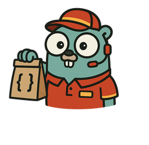

# jsonschematogo



A customizable JSON Schema to Go struct generator with support for custom
extensions and type overrides.

## Status

**Early Development** - This project is in active development and may not do
what this README claims.

## Overview

`jsonschematogo` converts JSON Schema definitions into Go struct types with
proper JSON tags and type mapping. Inspired
by [oapi-codegen](https://github.com/oapi-codegen/oapi-codegen), it aims to be
the JSON Schema equivalent - providing the same level of flexibility and
customization for pure JSON Schema workflows that oapi-codegen provides for
OpenAPI.

Unlike existing tools like `go-jsonschema`, `jsonschematogo` focuses heavily on
**customization** and **extensibility**, allowing developers to control exactly
how their Go types are generated through custom schema extensions.

## Key Features

- **Custom Type Overrides**: Use `x-go-type` extensions to specify exact Go
  types
- **Schema References**: Full support for `$ref` references between schemas
- **Flexible Input**: Supports both JSON and YAML schema files
- **Modular Architecture**: Clean, extensible design for adding new features
- **Built on Standards**:
  Uses [santhosh-tekuri/jsonschema/v6](https://github.com/santhosh-tekuri/jsonschema)
  for robust JSON Schema parsing

## Install With [bindown](https://github.com/WillAbides/bindown)

```shell
bindown template-source add jsonschematogo https://github.com/WillAbides/jsonschematogo/releases/latest/download/bindown.yaml
bindown dependency add jsonschematogo --source jsonschematogo -y
```

## Usage

### Command Help

<!--- everything between the next line and the "end usage output" comment is generated by script/generate-readme --->
<!--- start usage output --->

```
Usage: jsonschematogo [flags]

Flags:
  -h, --help       Show context-sensitive help.
      --version    Output the jsonschematogo version and exit.
```

<!--- end usage output --->

### Schema References

The generator handles `$ref` references between schemas. For example, a
`company.yaml` that references `person.yaml`:

```yaml
$schema: https://json-schema.org/draft/2020-12/schema
type: object
x-go-type: Company
properties:
  ceo:
    $ref: "person.yaml"
    description: The company's CEO
  name:
    type: string
    description: The company's name
```

Generate from multiple schemas:

```bash
jsonschematogo -o types.go -pkg company person.yaml company.yaml
```

Will generate both `Company` and `Person` structs:

```go
package company

type Company struct {
	Ceo  Person `json:"ceo"`
	Name string `json:"name"`
}

type Person struct {
	Age   int    `json:"age"`
	Email string `json:"email"`
	Name  string `json:"name"`
}
```

## Custom Extensions

### `x-go-type`

Override the inferred Go type for any property or schema:

```yaml
properties:
  timestamp:
    type: string
    x-go-type: time.Time
  userID:
    type: string
    x-go-type: UserID  # Custom type
```

## Architecture

The generator uses a modular architecture:

- **`SchemaCompiler`**: Compiles and validates JSON schemas
- **`ExtensionHandler`**: Extracts and processes custom `x-` extensions
- **`TypeInferrer`**: Determines appropriate Go types from schema definitions
- **`CodeRenderer`**: Renders the final Go struct code
- **`GoStructGenerator`**: Orchestrates the entire generation process

## Contributing

This project is in early development. Contributions, ideas, and feedback are
welcome!

## License

[License TBD]

## Alternatives

- [atombender/go-jsonschema](https://github.com/atombender/go-jsonschema) - The
  inspiration for this project
- [ogen-go/ogen](https://github.com/ogen-go/ogen) - OpenAPI/JSON Schema code
  generator
